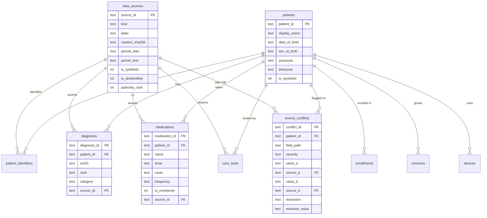
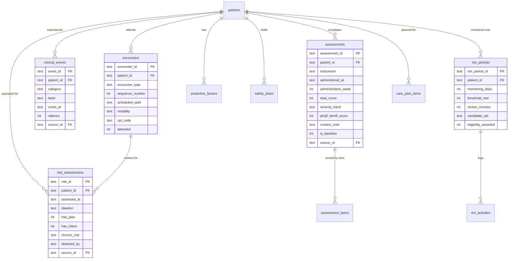

# Integrated per-patient schema

Supersedes `per-patient-schema.md`. That model normalized **three** files into twelve tables
and assumed one source of truth. This one integrates **four** sources — the CareLinq bundle
(`patient.json`, `self_report.json`, `healthkit.json`) and the Behavidence Enhanced Clinical
RTM report (PDF) — into **33 tables and 4 views**, and is built around the fact that the
sources contradict each other.

DDL: `integrated-schema.sql`. Verified by loading both sources into SQLite with
`PRAGMA foreign_keys = ON`: 1,849 rows, zero FK violations, all README test cases pass.

Conventions carried forward unchanged:

- Timestamps are ISO 8601 text with offset (`2026-08-20T22:18:00-04:00`); dates are `YYYY-MM-DD`.
  Both sort lexically, so `ORDER BY` works without parsing.
- Booleans are `INTEGER` 0/1.
- Natural keys from the source are the primary keys; tables without one use a composite.
- `patient_id` is on every patient-scoped table so a single predicate scopes any query.
- Dialect is the common subset of SQLite and Postgres — `TEXT`/`INTEGER`/`REAL` only, no
  `JSONB`, `ENUM`, `SERIAL`, or dialect date functions.

## What changed and why

### 1. Provenance is mandatory

Every clinical fact carries `source_id` into `data_sources`. This is the load-bearing change.
The two sources describe clinically incompatible pictures:

| | CareLinq bundle | Behavidence RTM |
|---|---|---|
| Primary Dx | F33.1 MDD recurrent **moderate** | F33.2 MDD recurrent **severe** |
| Secondary | G47.00 insomnia | F41.1 GAD, F43.10 PTSD, severe GI/TPN |
| Medication | sertraline 50 mg PO daily | Spravato 84 mg IN weekly (REMS) |
| PHQ-9 | 18 → 7 over 12 weeks, item-level | 24 → 16 → 20 → 9, totals only |
| Provenance | `_synthetic: true` | de-identified real-format |

Under the old model, loading both means one silently overwrites the other — `clinical` is a
single JSON column. Here both load as rows and the UI can show "per CareLinq… / per
Behavidence…". `data_sources.authority_rank` gives a deterministic tie-break when a view must
pick one; `is_synthetic` stops demo data being mistaken for real.

### 2. Conflicts are data, not prose

`source_conflicts` makes disagreement queryable, with a resolution workflow
(`unresolved | prefer_a | prefer_b | both_valid | manual_override`). The dashboard can render
"2 unresolved conflicts" instead of quietly picking a winner. Note the PDF *already* documents
one internally — its assessment table says PHQ-9 7, its narrative says 9 — so this table has
real rows on day one.

### 3. Clinical facts promoted out of JSON

`enrollment` / `clinical` / `care_team` were JSON columns. `diagnoses`, `medications`,
`care_team`, `consents`, `devices` and `enrollments` are now tables. Required for multi-source
(you cannot have two sources' diagnoses in one JSON column), and it makes "is HealthKit sharing
still consented?" an indexed lookup rather than a JSON parse — a question with access-control
consequences.

### 4. `sessions` → `encounters`, plus an event timeline

The old `sessions` held weekly therapy only. `encounters` covers `intake`, `therapy_session`,
`psychiatry_followup`, `medication_treatment`, `hospitalization`, `check_in` — the PDF's
Spravato visits and hospitalization have somewhere to live.

`clinical_events` is the cross-source timeline (`job_loss` 2026-08-20, `safety_plan_created`
2026-09-09, hospitalization, job offer). This is where integration pays off: the layoff comes
from a journal entry, the hospitalization from the PDF, and the dashboard annotates one chart
with both.

### 5. Long-form observations

Two daily passive streams now (HealthKit physiology, Behavidence MHSS), more later. A wide
`daily_metrics` table needs a migration per new metric. `daily_observations` is keyed
`(patient_id, obs_date, metric_code)` and absorbs new streams as rows; `metric_definitions` is
the lookup that keeps it self-describing.

**The trade-off is real**: you lose per-column types and NOT NULL. The mitigation is
`v_healthkit_daily`, which pivots back to exactly the old wide shape — verified to reproduce
84 rows, 76 `watch_worn`, 8 NULL HRV, 0 NULL steps. Existing queries port unchanged.

`observation_coverage` holds *why* a value is missing once per day rather than once per metric.

`sleep_sessions` stays wide — a structured nightly event, not a scalar.

### 6. Journals and voice notes merged

Both carry the same analysed fields (`ai_summary`, `sentiment_score`, `shared_with_clinician`,
transcript/text). `narratives` holds both, discriminated by `medium`, so the NLP columns and
every downstream query exist once.

### 7. Themes and tags are child tables

`ai_themes LIKE '%passive_ideation%'` was the highest-priority safety query in the product
running as a substring scan over JSON — and it matches `not_passive_ideation` too.
`narrative_themes` makes it an index seek, and `theme_definitions.is_risk_flag` moves the alert
rule into data instead of a hardcoded string list. Same for `mood_checkin_tags`: tag frequency
becomes a `GROUP BY`.

### 8. Safety is its own domain

Risk is asserted three ways — instrument (PHQ-9 item 9), clinician (PDF §7), and NLP over
narrative text — and the old model only captured the first. `risk_assessments.detected_by`
records which, `protective_factors` and `safety_plans` complete the picture, and
`v_safety_signals` unions all three into one priority-ordered feed.

`assessments.phq9_item9_score` stays denormalized and indexed — it is the single
highest-value query in the system. It is **nullable**, and `NULL` ("not captured", as for all
four PDF-sourced PHQ-9s) is deliberately distinct from `0` ("asked, denied").

### 9. RTM / billing modeled, eligibility never inferred

`rtm_periods` and `rtm_activities` capture monitoring days, the 16-day threshold, review
minutes, and interactive communication. `eligibility_asserted` is nullable on purpose: the
source PDF marks 98980 "eligible" while recording 0 minutes of review time, and the enhanced
report explicitly declines to resolve that. The schema preserves the ambiguity rather than
computing a billing claim from incomplete data.

### 10. Fixes carried over from the audit

- **Foreign keys are now declared.** The old doc left them implied, reasoning that the importer
  was the only writer — no longer true with multiple sources. Postgres enforces them; SQLite
  treats them as documentation unless `PRAGMA foreign_keys = ON`. Insert in file order.
- `practice_daily_logs.date` → `log_date` (reserved word in some dialects).
- `CHECK` constraints on every enum, range, and the `make_it_happen` ⇔ `target_per_week` rule.
- `is_synthetic` on `patients` and `data_sources` (the old model dropped `_synthetic` silently).
- `sleep_sessions` is **not** 1:1 with worn nights — 75 sessions vs 76 worn days, because
  2026-10-04 is worn with no session. `observation_coverage.sleep_session_present` records this
  so a "last night's sleep" tile can distinguish absent from zero.
- The weekly engagement query is fixed (see below).

## Table index

| Domain | Tables |
|---|---|
| Provenance | `data_sources` |
| Identity | `patients`, `patient_identifiers`, `enrollments`, `consents`, `devices` |
| Clinical facts | `diagnoses`, `medications`, `care_team` |
| Timeline | `encounters`, `clinical_events` |
| Assessments | `assessments`, `assessment_items` |
| Self-report | `mood_checkins`, `mood_checkin_tags`, `narratives`, `narrative_themes`, `theme_definitions` |
| Practices | `practices`, `practice_daily_logs`, `practice_weekly_cycles`, `meet_the_moment_logs` |
| Passive | `metric_definitions`, `daily_observations`, `observation_coverage`, `sleep_sessions` |
| Safety | `risk_assessments`, `protective_factors`, `safety_plans` |
| RTM | `rtm_periods`, `rtm_activities`, `care_plan_items` |
| Data quality | `source_conflicts` |
| Views | `v_healthkit_daily`, `v_mhss_daily`, `v_daily_integrated`, `v_safety_signals` |

Loaded row counts for this patient: 1,849 across 33 tables (vs. 655 across 12 before —
the increase is the PDF's content plus the de-JSON-ing, not duplication).

## Migration from `per-patient-schema.md`

| Old | New |
|---|---|
| `patients.clinical` JSON | `diagnoses`, `medications` rows |
| `patients.enrollment` JSON | `enrollments`, `consents`, `devices` rows |
| `patients.care_team` JSON | `care_team` rows |
| `sessions` | `encounters` where `encounter_type IN ('intake','therapy_session')` |
| `phq9_responses` | `assessments` where `instrument = 'PHQ-9'` |
| `phq9_responses.items` JSON | `assessment_items` rows |
| `phq9_responses.item9_score` | `assessments.phq9_item9_score` (now nullable) |
| `journal_entries` | `narratives` where `medium = 'journal'` |
| `voice_notes` | `narratives` where `medium = 'voice_note'` |
| `*.ai_themes` JSON | `narrative_themes` rows |
| `mood_checkins.emotion_tags` JSON | `mood_checkin_tags` rows |
| `daily_metrics` | `daily_observations` + `observation_coverage`; read via `v_healthkit_daily` |
| `practice_daily_logs.date` | `practice_daily_logs.log_date` |
| — | everything in Provenance / Safety / RTM / Data quality |

## Queries the README test cases reduce to

```sql
-- 1. Safety: PHQ-9 item 9. Note `> 0`, not `IS NOT NULL` — NULL means not captured.
SELECT administered_at, total_score, phq9_item9_score
  FROM assessments WHERE patient_id = ? AND phq9_item9_score > 0;

-- 2. Reliable deterioration, scoped to one source so the two PHQ-9 series don't interleave.
SELECT a.administration_week, a.total_score
  FROM assessments a
 WHERE a.patient_id = ? AND a.instrument = 'PHQ-9' AND a.source_id = ?
   AND a.total_score - (SELECT MIN(b.total_score) FROM assessments b
                         WHERE b.patient_id = a.patient_id AND b.source_id = a.source_id
                           AND b.administration_week < a.administration_week) >= 5;

-- 5. Risk language: index seek, and the risk list lives in data.
SELECT n.created_at, t.theme, n.ai_summary
  FROM narratives n
  JOIN narrative_themes t  ON t.narrative_id = n.narrative_id
  JOIN theme_definitions d ON d.theme = t.theme AND d.is_risk_flag = 1
 WHERE n.patient_id = ? ORDER BY d.alert_priority, n.created_at;

-- 6. Engagement per week. The old query claimed "per ISO week" but grouped by DAY,
--    returning 72 rows of count 1. Bucket against the practice cycle calendar instead.
SELECT c.week, COUNT(DISTINCT m.checkin_id) AS checkins
  FROM (SELECT DISTINCT patient_id, week, cycle_start, cycle_end
          FROM practice_weekly_cycles) c
  LEFT JOIN mood_checkins m
         ON m.patient_id = c.patient_id
        AND substr(m.logged_at, 1, 10) BETWEEN c.cycle_start AND c.cycle_end
 WHERE c.patient_id = ? GROUP BY c.week ORDER BY c.week;
-- verified: 7,7,7,7,7,4,5,6,6,5,5 — the wk 6–7 drop the README predicts.

-- 7. Sleep 7-night rolling mean (window function; SQLite 3.25+ and Postgres).
SELECT night_of, AVG(total_asleep_min) OVER (ORDER BY night_of ROWS 6 PRECEDING) AS asleep_7n
  FROM sleep_sessions WHERE patient_id = ?;

-- NEW. Body-mind overlay across all four sources on one row.
SELECT * FROM v_daily_integrated WHERE patient_id = ? ORDER BY obs_date;

-- NEW. Unified safety feed: instrument + clinician + NLP, priority ordered.
SELECT * FROM v_safety_signals WHERE patient_id = ? ORDER BY priority, signal_at;

-- NEW. Unresolved source disagreements, for the data-quality badge.
SELECT severity, field_path, value_a, value_b, note
  FROM source_conflicts WHERE patient_id = ? AND resolution = 'unresolved';

-- NEW. Passive-vs-self-report divergence — the PDF's central caveat, as a query.
SELECT x.obs_date, x.mhss_depression, a.total_score AS phq9
  FROM v_mhss_daily x
  LEFT JOIN assessments a
         ON a.patient_id = x.patient_id AND substr(a.administered_at,1,10) = x.obs_date
 WHERE x.patient_id = ? ORDER BY x.obs_date;
```

## Not modeled

- **Free-text narrative from the PDF** (clinician notes, §6 clinical context, §11) is held as
  `clinical_events.description` and `care_plan_items.plan_text` rather than a parsed structure.
  Promote to columns when a query needs to filter on it.
- **MHSS dates are redacted** in the source PDF. The 19 daily rows are ordered and
  contiguous but their true calendar dates are unknown; any loader must assign
  placeholder dates and record that fact. This blocks exact day-level alignment between
  MHSS and the HealthKit/self-report streams.
- `scale` strings on `mood_checkins` and `meet_the_moment_logs` are still dropped — fixed and
  documented in column comments.
- `hk_type` on sleep sessions and `source`/`aggregation` on daily metrics are dropped; all are
  constant per column and now live in `metric_definitions`.
- No `patients`-level roster rollup table. Compute from views; add a materialized rollup only
  when the roster query becomes slow.

## Entity-relationship diagrams

Split by domain — 33 tables in one diagram is unreadable.

### Provenance and clinical facts



### Encounters, assessments and safety



### Self-report, practices and passive streams

```mermaid
erDiagram
    patients ||--o{ mood_checkins : "logs"
    patients ||--o{ narratives : "authors"
    patients ||--o{ practices : "commits to"
    patients ||--o{ daily_observations : "generates"
    patients ||--o{ observation_coverage : "coverage per day"
    patients ||--o{ sleep_sessions : "nightly"
    mood_checkins ||--o{ mood_checkin_tags : "tagged"
    narratives ||--o{ narrative_themes : "tagged"
    theme_definitions ||--o{ narrative_themes : "defines"
    metric_definitions ||--o{ daily_observations : "defines"
    practices ||--o{ practice_daily_logs : "completed?"
    practices ||--o{ practice_weekly_cycles : "weekly rollup"
    practices ||--o{ meet_the_moment_logs : "event-triggered"

    narratives {
        text narrative_id PK
        text patient_id FK
        text medium
        text created_at
        text body_text
        int word_count
        int duration_sec
        text audio_uri
        real transcription_confidence
        text ai_summary
        real sentiment_score
        int shared_with_clinician
    }
    theme_definitions {
        text theme PK
        text display_name
        int is_risk_flag
        int alert_priority
    }
    metric_definitions {
        text metric_code PK
        text display_name
        text unit
        text domain
        text requires_device
        int higher_is_better
        int is_diagnostic
    }
    daily_observations {
        text patient_id PK_FK
        text obs_date PK
        text metric_code PK_FK
        real value
        text source_id FK
    }
    observation_coverage {
        text patient_id PK_FK
        text obs_date PK
        int watch_worn
        int phone_monitoring
        int sleep_session_present
    }
    sleep_sessions {
        text patient_id PK_FK
        text night_of PK
        text in_bed_start
        text in_bed_end
        int sleep_onset_latency_min
        int total_asleep_min
        int awakenings
        int asleep_core_min
        int asleep_deep_min
        int asleep_rem_min
        real sleep_efficiency
    }
```
